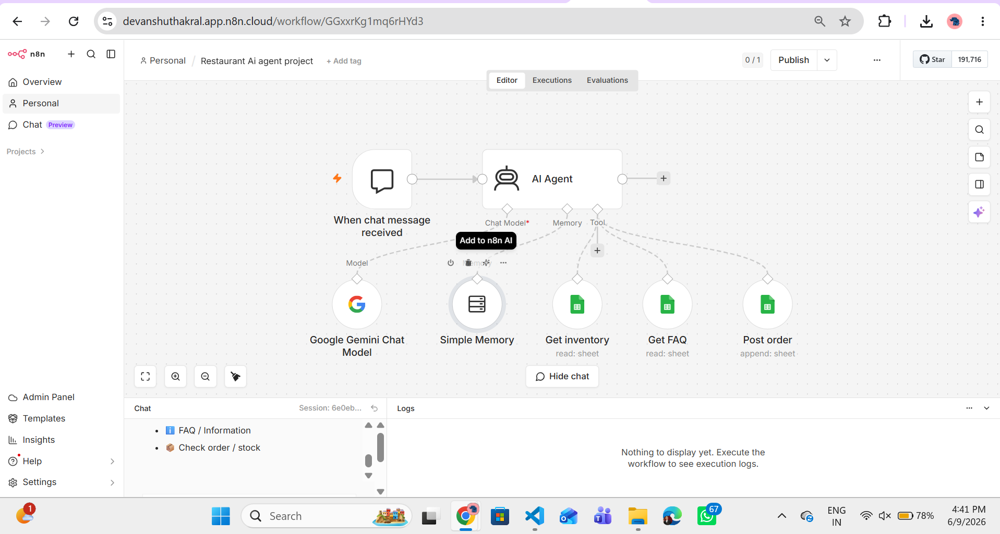
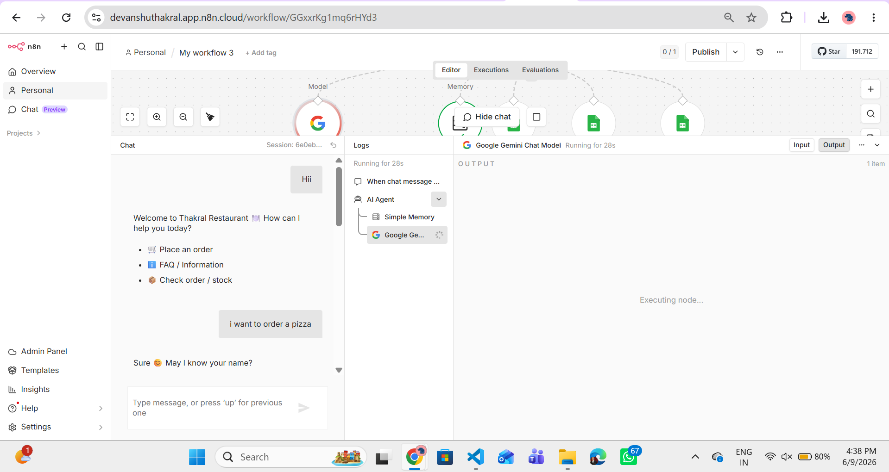
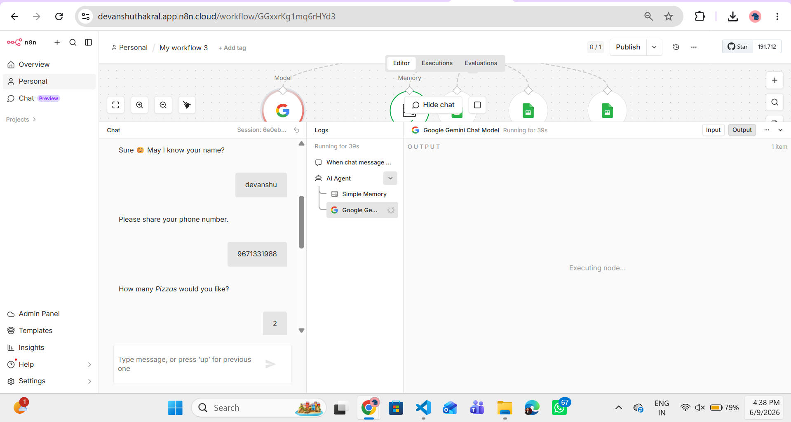
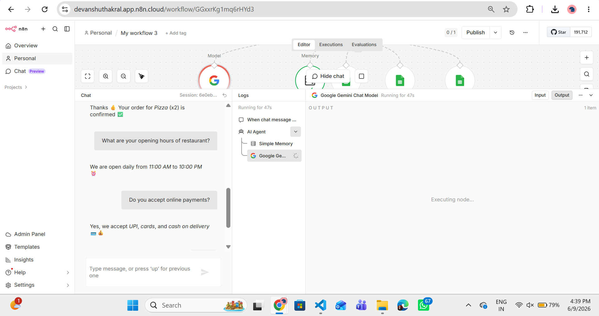

# 🍕 Restaurant AI Agent

An AI-powered Restaurant Assistant built with **n8n**, **Google Gemini**, and **Google Sheets** to automate food ordering, inventory management, FAQ handling, and customer support.

---

## 📌 Overview

This project demonstrates how AI can streamline restaurant operations by automating customer interactions and order management.

The assistant can:

* Accept food orders
* Collect customer information
* Verify inventory availability
* Answer restaurant FAQs
* Store orders automatically in Google Sheets
* Maintain conversation context using memory

---

## 🏗️ Workflow Architecture

The workflow is built using n8n AI Agent and integrates Gemini with custom tools connected to Google Sheets.



---

## 🚀 Features

### 🍕 Smart Food Ordering

* Conversational food ordering
* Customer information collection
* Order confirmation
* Quantity selection

### 📦 Inventory Verification

* Real-time stock checking
* Product availability verification
* Inventory management using Google Sheets

### ❓ FAQ Support

The assistant can answer questions such as:

* Opening hours
* Payment methods
* Delivery information
* Restaurant policies

### 📝 Automated Order Processing

* Stores orders automatically
* Reduces manual effort
* Maintains organized records

### 🧠 Context-Aware Conversations

* Maintains conversation history
* Supports multi-step interactions
* Improves customer experience

---

## 📸 Project Screenshots

### Food Order Request



### Customer Details Collection



### FAQ Support



---

## 💬 Sample Interaction

```text
Customer: I want to order a Pizza

Assistant: May I know your name?

Customer: Devanshu

Assistant: Please share your phone number.

Customer: 9671331988

Assistant: How many Pizzas would you like?

Customer: 2

Assistant: Thanks! Your order for Pizza (x2) is confirmed.
```

---

## 🛠️ Tech Stack

* n8n
* Google Gemini
* Google Sheets
* AI Agent
* Simple Memory

---

## 📂 Workflow Structure

```text
When Chat Message Received
            │
            ▼
        AI Agent
            │
 ┌──────────┼──────────┐
 ▼          ▼          ▼
Inventory   FAQ     Post Order
 Tool       Tool       Tool
            │
            ▼
     Google Sheets
```

---

## 🎯 Use Cases

* Restaurants
* Cafés
* Food Delivery Businesses
* Customer Support Automation
* AI Order Management Systems

---

## 🔥 Key Highlights

* AI-powered ordering assistant
* Inventory-aware order processing
* Automated FAQ handling
* Google Sheets integration
* Context-aware conversations
* No-code / Low-code automation using n8n

---

## 🚀 Future Enhancements

* WhatsApp Integration
* Online Payments
* Live Order Tracking
* Multi-language Support
* SMS & Email Notifications
* Analytics Dashboard

---

## 👨‍💻 Author

**Devanshu Thakral**

LinkedIn:
https://www.linkedin.com/in/devanshu-thakral-6297a12b9

GitHub:
https://github.com/DevanshuThakral

---

## ⭐ Support

If you found this project useful, consider giving it a star on GitHub.
